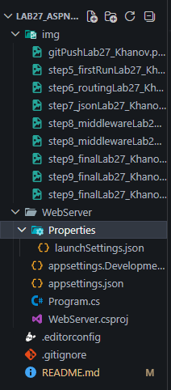

## Лабораторная работа №27. Знакомство с ASP.NET Core: первый веб-сервер на C#

### Основная информация

**ФИО:** Ханов Владислав Вячеславович

**Группа:** ИСП-231

**Дата:** 14.04.2026

### Краткое описание

Мы установили .NET SDK и настроили проект в VS Code. Создали минимальный веб-сервер на ASP.NET Core. Разобрались с маршрутизацией и middleware

### Структура проекта

### Реализованные маршруты:

- http://localhost:5039/
- http://localhost:5039/about
- http://localhost:5039/time
- http://localhost:5039/hello/Иван 
- GET/
- GET/me
- GET/calc/{a}/{b}

### Главные выводы

1. **ASP.NET Core** — мощный кроссплатформенный фреймворк, позволяющий быстро создавать веб-серверы и API с производительностью, близкой к нативным решениям (например, Actix на Rust).

2. **Middleware и порядок регистрации критически важны:** цепочка обработки запроса строится последовательно. Если зарегистрировать маршруты до middleware (например, `app.MapGet` до `app.Use`), то middleware не будет выполняться для этих маршрутов, что нарушит логирование, аутентификацию и другие сквозные функции.

3. **Minimal API** значительно упрощает создание прототипов и небольших сервисов по сравнению с MVC: нет контроллеров, минимум шаблонного кода, но сохраняется полный контроль над пайплайном запросов.

### Итоговая таблица

| Характеристика | ASP.NET Core |
|----------------|---------------|
| **Создание сервера** | `WebApplication.CreateBuilder()` |
| **Запуск** | `app.Run()` |
| **Маршрут GET** | `app.MapGet("/", fn)` |
| **Параметр маршрута** | `{name}` → `(string name)` |
| **Возврат JSON** | `return new {...}` / `Results.Ok(...)` |
| **Middleware** | `app.Use(async (ctx, next) => ...)` |
| **Логирование** | Встроенное + `Console.WriteLine` |
| **Статус ответа** | `Results.NotFound(...)` |
| **Тип данных** | Строгие (C# record, class) |

### Интересные факты

- **Stack Overflow** — один из крупнейших сайтов вопросов и ответов для программистов, полностью работает на ASP.NET Core (ранее на ASP.NET MVC). Обслуживает миллионы запросов в день с очень низкой задержкой.
- **Microsoft Teams**, **Bing** и **Outlook.com** используют ASP.NET Core для своих бэкенд-сервисов.
- **ASOS**, **Alibaba** и **Siemens** строят свои высоконагруженные e-commerce платформы на ASP.NET Core благодаря его производительности и масштабируемости.

### Ответы на  вопросы

#### 1. Чем Minimal API отличается от MVC в ASP.NET Core?
**Minimal API** позволяет создавать конечные точки с минимальным количеством кода: без контроллеров, без атрибутов `[ApiController]`, без явной настройки маршрутизации через атрибуты. Подходит для микросервисов и прототипов. **MVC** использует контроллеры с методами действий, поддерживает представления (Razor), модели и фильтры — лучше подходит для крупных приложений с веб-интерфейсом.

#### 2. Что произойдёт, если поставить `app.MapGet(...)` до `app.Use(...)`?
Если зарегистрировать маршрут до middleware, то при совпадении маршрута middleware **не будет выполнена**, так как запрос будет сразу обработан конечной точкой и вернётся ответ, не проходя через последующие слои пайплайна. Это часто приводит к ошибкам, например, логирование или проверка ключа не сработают.

#### 3. Почему ASP.NET Core преобразует PascalCase в camelCase при сериализации JSON?
Это стандартное соглашение для JSON в JavaScript-экосистеме (camelCase — `firstName`, а не `FirstName`). ASP.NET Core использует `System.Text.Json` с политикой именования по умолчанию `JsonNamingPolicy.CamelCase`, что обеспечивает совместимость с клиентами на JavaScript/TypeScript. Поведение можно изменить, задав собственную политику.

#### 4. Что означает код ответа HTTP 401? А 404? А 200?
- **200 OK** — запрос успешно выполнен, данные возвращены.
- **401 Unauthorized** — клиент не авторизован (например, отсутствует или неверный API-ключ, как в middleware из шага 8).
- **404 Not Found** — запрошенный ресурс не существует на сервере (маршрут не зарегистрирован).

#### 5. Чем `dotnet run` отличается от `dotnet watch run`?
`dotnet run` — однократный запуск приложения. При изменении кода сервер не перезагружается автоматически.  
`dotnet watch run` — запуск с отслеживанием файлов. При любом изменении исходного кода сервер автоматически перекомпилируется и перезапускается (горячая перезагрузка), что ускоряет разработку.

